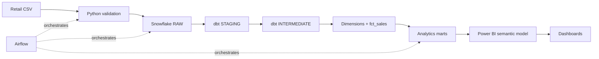

# RetailIQ — Retail Data Platform & Revenue Analytics

RetailIQ is an end-to-end retail analytics reference project: Python validates
source data, Snowflake stores the raw layer, dbt builds a dimensional model,
Airflow orchestrates the batch, and Power BI is given a documented semantic-model
handoff.

The deterministic local baseline contains **100,000 synthetic transaction lines**
generated with seed `42`. It is designed to demonstrate a credible engineering
workflow without committing a large dataset or any personal data.

## Verified baseline

| Metric | Value |
|---|---:|
| Transactions | 100,000 |
| Customers / products / stores | 2,000 / 27 / 8 |
| Date range | 2024-01-01 → 2025-12-31 |
| Revenue | $33,129,143.92 |
| Profit / margin | $5,579,892.30 / 16.84% |
| Units sold | 162,086 |
| Average order value | $331.29 |
| KPI definitions | 10 |

These values are reproducible with `python scripts/generate_sample_data.py
--rows 100000 --seed 42` and are summarized in
[`docs/sample_metrics.json`](docs/sample_metrics.json).

## Business problem and solution

Raw retail transactions are difficult for business stakeholders to use directly.
RetailIQ validates and loads source records, separates raw/staging/intermediate/
mart responsibilities, publishes a star schema, and exposes KPI-ready models for
revenue, profitability, product, customer, store, and time analysis.



## Technology stack

Python · SQL · Apache Airflow · dbt · Snowflake · Power BI · pytest · GitHub Actions

## Data model

`fct_sales` has one row per retail transaction line. It retains source natural
keys and joins to deterministic MD5 surrogate keys in `dim_customer`,
`dim_product`, `dim_date`, and `dim_store`. The marts are daily KPI, product,
customer, and store performance models.

Customer, product, and store dimensions use Type 1 behavior because the source
feed is a current embedded snapshot with no effective-dated history. The decision
and the Type 2 extension path are documented in
[`docs/interview_guide.md`](docs/interview_guide.md).

## Data quality and reliability

- Python validates required headers, schema drift, identifiers, dates, numeric
  ranges, duplicate IDs, sales formulas, and profit formulas.
- Accepted and rejected rows plus a JSON summary are written for every local
  batch; rejected rows are never silently dropped.
- Snowflake uses a landing table and `MERGE` on `transaction_id`.
- dbt uses unique keys, `loaded_at` watermarks, a two-day late-arrival lookback,
  `on_schema_change='fail'`, relationship tests, and singular reconciliation tests.
- Airflow reconciles raw/fact counts and revenue before marking the pipeline done.

See [`docs/data_quality.md`](docs/data_quality.md) and
[`docs/data_lineage.md`](docs/data_lineage.md).

## KPIs and verified insights

Implemented KPIs include Total Revenue, Total Profit, Profit Margin %, Total
Transactions, Average Order Value, Units Sold, Revenue per Customer, Repeat
Customer Rate %, Revenue Growth %, and Top Product Contribution %. Definitions
and formulas are in [`docs/kpi_dictionary.md`](docs/kpi_dictionary.md); DAX is in
[`powerbi/measures.md`](powerbi/measures.md).

The generated baseline shows Electronics at 74.74% of revenue but only 9.21%
margin, Laptop Pro 14 at 27.77% of total revenue, Smartphone X at the weakest
product margin (4.55%), Boston leading store revenue, and Denver leading store
margin (17.26%). These are synthetic-data findings and are documented in
[`docs/insights.md`](docs/insights.md).

## Repository structure

```text
src/retailiq/              reusable ingestion, validation, generation, metrics
scripts/                   local generation, ingestion, and contract checks
tests/                     pytest unit tests
dags/                      Airflow orchestration
snowflake/                 database, stage, raw table, load, validation SQL
dbt/                      sources, staging, intermediate, marts, tests, macros
powerbi/                   semantic model, DAX measures, dashboard specification
streamlit_app.py           interactive local/Snowflake dashboard
notebooks/                 Jupyter analysis walkthrough
reports/                   generated static HTML report
docs/                      architecture, lineage, quality, setup, KPIs, interview guide
data/                      empty Git-tracked landing directories; generated files ignored
```

## Getting started locally

```bash
python -m venv .venv
# Windows PowerShell: .\.venv\Scripts\Activate.ps1
python -m pip install -r requirements.txt
python scripts/generate_sample_data.py --rows 100000 --seed 42
python scripts/run_ingestion.py --fail-on-rejects
python scripts/validate_project.py
pytest
```

The local demonstration requires no cloud credentials. Generated data is ignored
by Git. For the full Snowflake + dbt + Airflow path, follow
[`docs/setup.md`](docs/setup.md), configure `.env` privately from
[`.env.example`](.env.example), and use the Snowflake/Airflow connection guidance.

## Demo options beyond Power BI

The project includes several presentation paths so the work can be reviewed
without a Power BI license or a `.pbix` file:

- **Live Streamlit dashboard:** [Open RetailIQ Revenue Analytics](https://retailiq-retail-data-platform-bv7cmxx76gmya93dhfzscx.streamlit.app/).
- **Streamlit locally:** run `python -m pip install -r requirements-demo.txt`, then
  `streamlit run streamlit_app.py`. It defaults to the verified local snapshot
  and can optionally query the live Snowflake analytics schema.
- **Airflow:** run `docker compose up -d` and open
  [http://localhost:8080](http://localhost:8080) to show the successful DAG.
- **dbt docs:** use the commands in [`docs/demo_guide.md`](docs/demo_guide.md)
  to generate lineage, model metadata, and test documentation on port 8081.
- **Jupyter:** open [`notebooks/retailiq_analysis.ipynb`](notebooks/retailiq_analysis.ipynb)
  for a reproducible KPI and chart walkthrough.
- **Static HTML:** run `python scripts/build_static_report.py` and open
  [`reports/retailiq_report.html`](reports/retailiq_report.html) in any browser.
- **PDF evidence report:** open the sanitized
  [`RetailIQ evidence report`](output/pdf/retailiq_evidence_report.pdf), generated
  by `python scripts/build_pdf_report.py`.

The full walkthrough, including a recommended presentation order, is in
[`docs/demo_guide.md`](docs/demo_guide.md). The sanitized run results and
reproduction commands are in [`docs/run_evidence.md`](docs/run_evidence.md).

## Power BI status

This repository does **not** include a fabricated `.pbix` file. The full semantic
model, relationships, DAX measures, and report pages are specified in
[`powerbi/`](powerbi/). Building and refreshing the interactive report remains a
manual Power BI Desktop step because that binary cannot be generated reliably in
this environment.

## Scalability and future improvements

The design is incremental and idempotent at the business-key level. The current
100K scale does not justify clustering. The evolution path for 1M, 10M, and 100M+
rows—plus batch manifests, object-storage ingestion, monitoring, and Type 2
history—is documented in [`docs/scalability.md`](docs/scalability.md).

## License

MIT. See [`LICENSE`](LICENSE).
