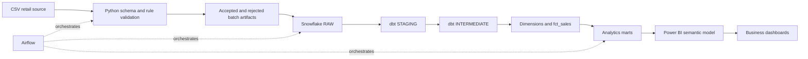

# Architecture

RetailIQ separates source handling, warehouse storage, analytics engineering,
orchestration, and BI so each layer has one responsibility.

## Responsibilities

- Python reads files, normalizes headers, validates source rules, writes
  accepted/rejected artifacts, and generates deterministic demo data. It does
  not own warehouse business joins or KPI aggregations.
- Snowflake RAW preserves source fields and adds batch/file/load metadata. The
  `MERGE` load is keyed by `transaction_id` for rerun safety.
- dbt casts and standardizes the raw feed, calculates reusable line-level
  fields, builds a star schema, and publishes reporting marts.
- Airflow coordinates tasks, retries failures, and runs reconciliation.
- Power BI owns the semantic model, measures, interactions, and communication
  of insights. No binary report is included until it can be authored and
  refreshed in Power BI Desktop.

