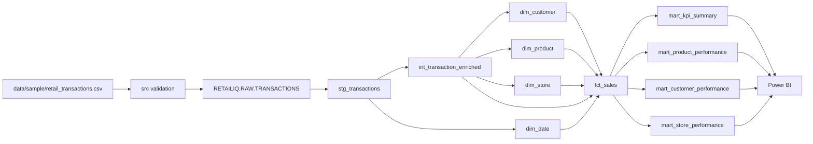

# Data lineage

```mermaid
flowchart LR
    source[data/sample/retail_transactions.csv]
    source --> validate[src validation]
    validate --> raw[RETAILIQ.RAW.TRANSACTIONS]
    raw --> stg[stg_transactions]
    stg --> int[int_transaction_enriched]
    int --> dc[dim_customer]
    int --> dp[dim_product]
    stg --> dd[dim_date]
    int --> ds[dim_store]
    int --> fact[fct_sales]
    dc --> fact
    dp --> fact
    dd --> fact
    ds --> fact
    fact --> kpi[mart_kpi_summary]
    fact --> product[mart_product_performance]
    fact --> customer[mart_customer_performance]
    fact --> store[mart_store_performance]
    kpi --> pbi[Power BI]
    product --> pbi
    customer --> pbi
    store --> pbi
```

The production path substitutes the source file and Snowflake stage for the
local sample path; model dependencies remain the same.

